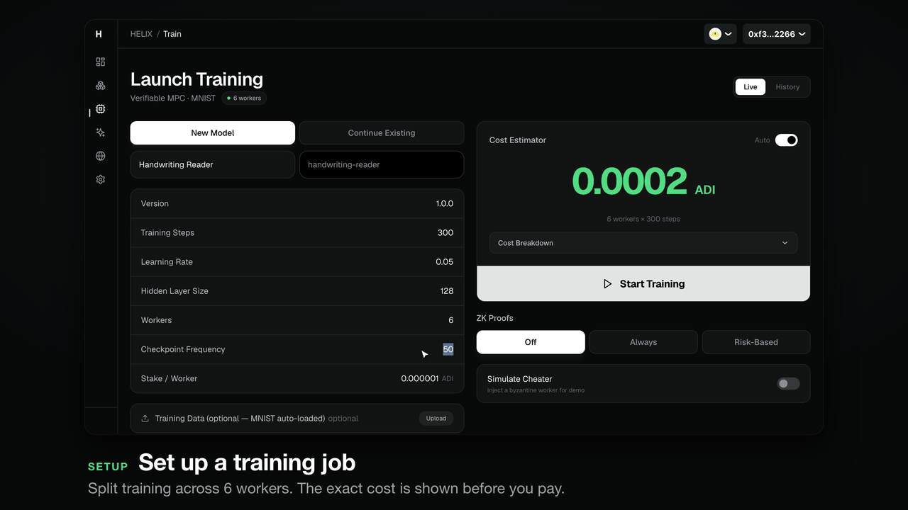
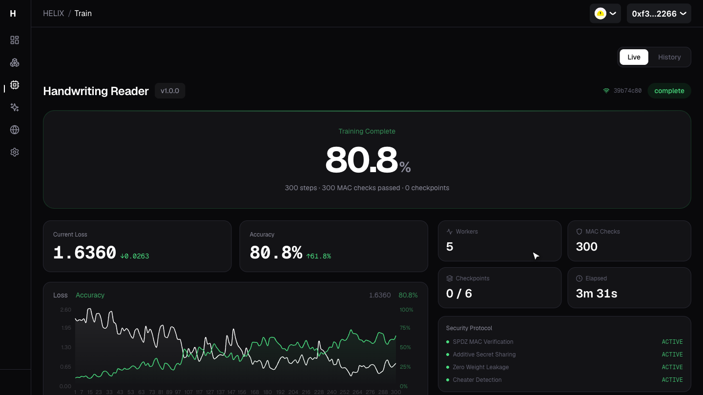
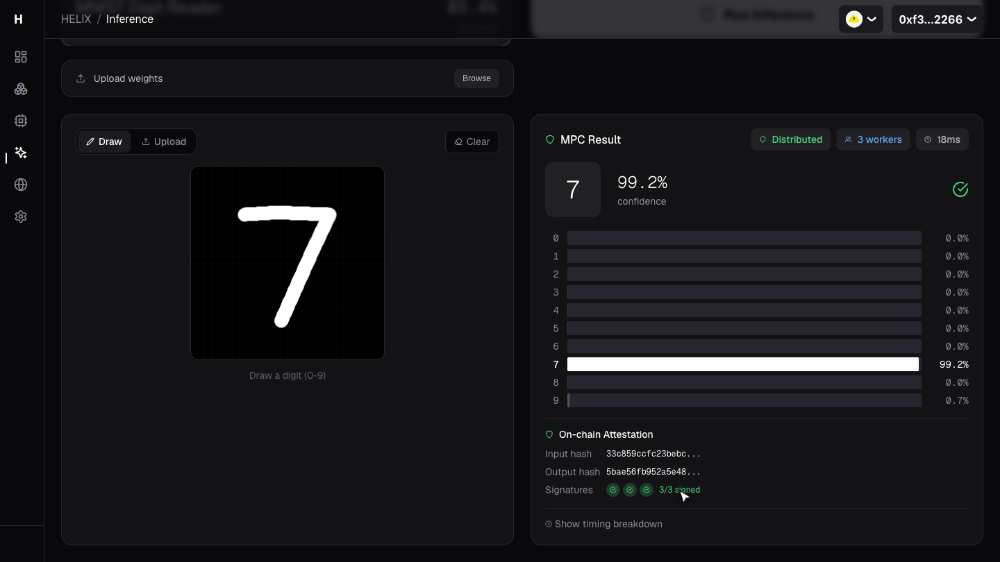
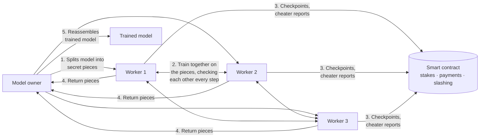

# HELIX

**Train AI models on other people's computers without showing them your model, and catch anyone who cheats.**

🏆 **Winner: ADI Foundation Open Project Submission bounty, ETHDenver 2026** · Solo project · Built in 4 weeks

[**▶ Watch the demo**](#demo) · [How it works](#how-it-works) · [Product decisions](#key-product-decisions) · [Run it locally](#run-it-locally) · [Technical deep dive](helix/docs/TECHNICAL_OVERVIEW.md)



---

## TL;DR

- **Problem:** Renting compute to train a model means trusting strangers with your most valuable asset (the model) and trusting that they actually did the work.
- **Solution:** HELIX splits the model into encrypted pieces across several workers. No single worker can see the model, every training step is checked, and a worker who tampers is caught, named, and removed while training keeps going.
- **Result:** A working end-to-end product (smart contracts, a training engine, and a web app) that trains a handwritten-digit model to **~85–89% accuracy** while catching a simulated cheater within **4 steps** of it misbehaving.

## Demo


https://github.com/user-attachments/assets/bf24cd8e-da8a-46af-b6db-2f1bdced2ae0


What the 75-second demo shows:

1. **Launch a training job:** pick settings, see the cost estimate, and optionally turn on "Simulate Cheater."
2. **Watch it train live:** 6 workers train together on a model none of them can see. Every step is verified.
3. **Catch the cheater:** halfway through, one worker starts tampering. HELIX flags it within a few steps, names the exact worker, removes it, and the remaining 5 keep training.
4. **Use the model:** draw a digit in the browser and the trained model classifies it.
5. **Own it and earn from it:** the trained model is minted as an NFT. The owner sets a per-use fee, lists the model for sale, and a second wallet buys it through escrow.

| Training finished after removing the cheater | Drawing a digit and running the model |
|---|---|
|  |  |

## The problem

AI training is expensive, so teams look for cheaper compute: idle GPUs, decentralized networks, other companies' spare capacity. That creates two trust problems:

| Who | What they worry about |
|---|---|
| **Model owner** (the customer) | *"If I send my model to a stranger's machine, they can copy it."* And: *"How do I know they really trained it instead of sending back garbage?"* |
| **Compute provider** (the worker) | *"I want to get paid fairly, and not get punished because someone else cheated."* |

Existing approaches each give something up. Cryptographic proofs of every step are 100–1,000× slower. Trusted hardware means trusting chip makers (and those chips have been broken before). Random spot checks can miss targeted cheating. And none of them keep the model private from the workers.

## How it works



1. **Split:** The model owner's app splits the model into random-looking pieces, one per worker. Any single piece reveals nothing. Only by adding all of them back together do you get the model.
2. **Train:** Workers train on their pieces using a technique called multi-party computation (MPC), so the math still works even though nobody holds the real model.
3. **Verify:** Every value carries a tamper-evident tag. If a worker changes anything, the tags stop adding up, and a quick round of pairwise checks shows exactly which worker it was.
4. **Settle:** Workers stake money to join. A smart contract records progress, pays honest workers, and can slash (confiscate) a cheater's stake.
5. **Reassemble:** At the end, workers hand their pieces back and only the owner can rebuild the trained model.
6. **Own and earn:** The trained model is minted as an NFT (ERC-721), so ownership and version history are public and verifiable. The owner can make it public and charge a fee (0–50%) on every paid inference, or list the model itself for sale on the marketplace.

## Key product decisions

**1. Killed the original approach halfway through.** HELIX started out generating a cryptographic (zero-knowledge) proof for every training step. That's the "obvious" answer for verifiable compute, but it's 100–1,000× slower than normal training: unusable for a real customer. Two weeks in, I pivoted to multi-party computation with built-in tamper checks. The design targets 5–15× overhead instead of 100–1,000×, and it also keeps the model private, something the proof approach never did.

**2. Made the expensive option optional instead of deleting it.** Some customers will want proof that a third party can verify independently. Rather than force that cost on everyone, the dashboard offers three modes: **Off** (default, cheapest), **Always**, and **Risk-based**, which turns proofs on automatically only after a cheater is caught and the group gets smaller.

**3. Punish the cheater, not the group.** "Someone cheated, restart everything" is unfair to honest workers and wasteful for the customer. HELIX identifies the specific worker, removes only them, and resumes training from the last checkpoint. That keeps honest workers willing to participate.

**4. Made the trained model a sellable asset, with escrow.** A model is only worth paying for if you can prove you own it and turn it into money. Minting it as an NFT handles ownership. Selling is harder: transferring the NFT alone doesn't hand over the encrypted weights, so either side could get burned. So a purchase puts the buyer's payment in escrow. The seller re-encrypts the weights for the buyer, and the NFT and payment then swap in a single transaction. If the seller never delivers, the buyer can take the money back after 24 hours.

**5. Designed for a 3-minute judge demo.** The core value (privacy plus cheater detection) is invisible by nature, so I built a **Simulate Cheater** toggle, a live phase tracker, and a cost estimator into the dashboard. A judge can see the whole story, including the failure case, in one run.

## Results

Measured by running the app locally (handwritten digit recognition on real MNIST data, 6 workers, 1 simulated cheater):

| Training length | Test accuracy | Cheater turned bad at | Caught at | Training after removal |
|---|---|---|---|---|
| 200 steps | 76.2% | step 100 | step 104 | ✅ continued with 5 workers |
| 500 steps | 85.0% | step 250 | step 254 | ✅ continued with 5 workers |
| 1,000 steps | 87.6–87.8% *(hackathon runs)* | | | |

The integrity check ran on every single step (500 checks in the 500-step run). In an on-chain run, the cheater's stake was also slashed by the smart contract in a real transaction. The best hackathon-era run reached **89.4%**.

**Scope:** 8 Rust modules (training engine, MPC, networking, proofs), 13,000 lines of Solidity smart contracts, a 28,000-line Next.js web app, and 5,500+ automated test cases, deployed to the ADI testnet for the hackathon.

## Limitations and what I'd do next

- **Demo-scale model.** It trains a small digit classifier, not a large language model. MPC adds overhead, so the next step is benchmarking larger models to find where the cost curve breaks.
- **Honest majority required.** If more than half of the workers collude, they can rebuild the model. That's a fundamental limit of this approach, which makes worker selection and staking size important product levers.
- **First job on a fresh local chain skips settlement.** The backend uses job ID 0 to mean "off-chain run," but a brand-new chain also hands out ID 0 to its first job. That job trains fine but skips on-chain checkpoints, payment, and NFT minting, and leaves the workers marked busy. On the long-running ADI testnet this never came up. A one-line fix is the top item on the list. Until then, see the workaround in [Run it locally](#run-it-locally).
- **Not audited.** This is hackathon code and hasn't had a security review.

## Tech stack

| Layer | Tools |
|---|---|
| Training engine and MPC | Rust |
| Optional proofs | Halo2 (zero-knowledge proof system) |
| Smart contracts | Solidity, Foundry, OpenZeppelin |
| Web app | Next.js, React, TypeScript, wagmi/viem (wallet connection), Recharts |
| Chain | ADI testnet (local development on Anvil) |
| Storage | 0G Network (encrypted model weights) |

## Run it locally

Requires Rust 1.75+, Node.js 18+, and [Foundry](https://book.getfoundry.sh/).

```bash
cd helix

# Builds the app on first run, then starts a local blockchain, deploys the contracts, launches the backend,
# 6 workers, and the web app at http://localhost:3000
TESTNET_PRIVATE_KEY=0xac0974bec39a17e36ba4a6b4d238ff944bacb478cbed5efcae784d7bf4f2ff80 ./start-local.sh

./start-local.sh stop   # shut everything down
```

The key above is Anvil's public, well-known test account, not a real wallet. Because of the job-ID-0 issue (see [Limitations](#limitations-and-what-id-do-next)), register one throwaway job right after startup so jobs started through the API or CLI settle on-chain. (Jobs launched from the web app on a local chain intentionally skip the on-chain payment and train off-chain; on the ADI testnet the web app registers and pays for the job on-chain.)

```bash
cast send 0xe7f1725E7734CE288F8367e1Bb143E90bb3F0512 \
  'registerTrainingJob(bytes32,uint256,uint256,uint256,bool,uint256,bool,uint256,address)' \
  0x0000000000000000000000000000000000000000000000000000000000000000 1 1 1 false 1 false 2 \
  0x0000000000000000000000000000000000000000 --value 1 --rpc-url http://127.0.0.1:8545 \
  --private-key 0x2a871d0798f97d79848a013d4936a73bf4cc922c825d33c1cf7073dff6d409c6
```
 Then open **http://localhost:3000/train**, leave the defaults (or set Training Steps to 500), turn on **Simulate Cheater**, and launch.

## Repository map

```
helix/
  crates/       Rust: training engine, MPC protocol, networking, proofs, CLI and backend
  contracts/    Solidity: training coordinator, staking, payments, slashing, proof verifier
  dashboard/    Next.js web app: train, inference, marketplace, network views
  docs/         System design and technical deep dive
```

For the full protocol (secret sharing, tamper-evident tags, how the cheater is pinpointed, contract design), see the **[technical deep dive](helix/docs/TECHNICAL_OVERVIEW.md)** and **[system design](helix/docs/SYSTEM_DESIGN.md)**.

---

Built by **Logan Staples** for ETHDenver 2026. MIT License.
